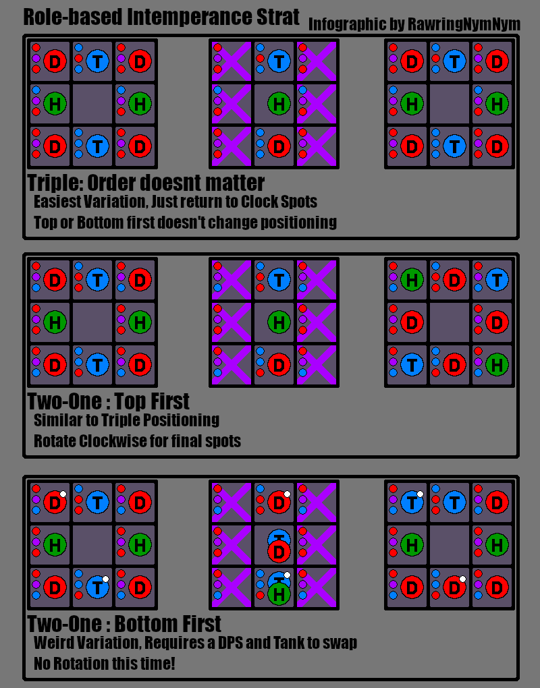

# Asphodelos: The First Circle (Savage)

# Phase 1
1. {TB} `Heavy Hand`
*(immediatly after)*
2. `Aetherial Shackles` {check debuff}
    * purple = close explosions
    * red = far explosions
*(after cast but before debuff explodes)*
3. {R_AOE} `Warder's Wrath`
4. `Gaoler's flail` (ball+chakram || scythe+scythe)
    * ball = {PBAOE} 
    * chakram = {D_AOE}
    * scythe = 270* side cleave
5. `Pitiless flail of Grace|Purgation`
    * Purgation = {move away}
    * Grace = {Stack} + {knockback}
6. `Gaoler's flail`

# Phase 2
1. `Intemperance`

2. `Warder's Wrath`
3. {R_AOE} `Shining Cells`
4. `Aetherflail` (ball+scythe || chakram+scythe)
    * `Aether Chain` go to opposite colour (like Normal)
    * always mix a ball|chakram with a scythe
5. `Pitiless Flail`
6. `Aetherflail`
7. `Shackles of Time` {single debuff}
    * colour where {debuff} player stands will explode
    * _rest of group always stands on red_
*(meanwhile)*
8. {TB} `Heavy Hand`
9. {RAOE} `SlamShut`
10. `Fourfold shackles`
    * puprle = inside; red = max melee
    * use debuff timer
11. `Warder's Wrath`

# Phase 3
1. `Intemperance II` + `Goaler's Flail`
    * flail right after **2nd crystal** explodes
2. `Shining Cells`
3. `Aetherial shackles` + `AetherChain`
4. `Shackles of Time`
5. `Pitiless Flail`
6. `Aetherflail`
7. `Warder's Wrath`
8. `ENRAGE`